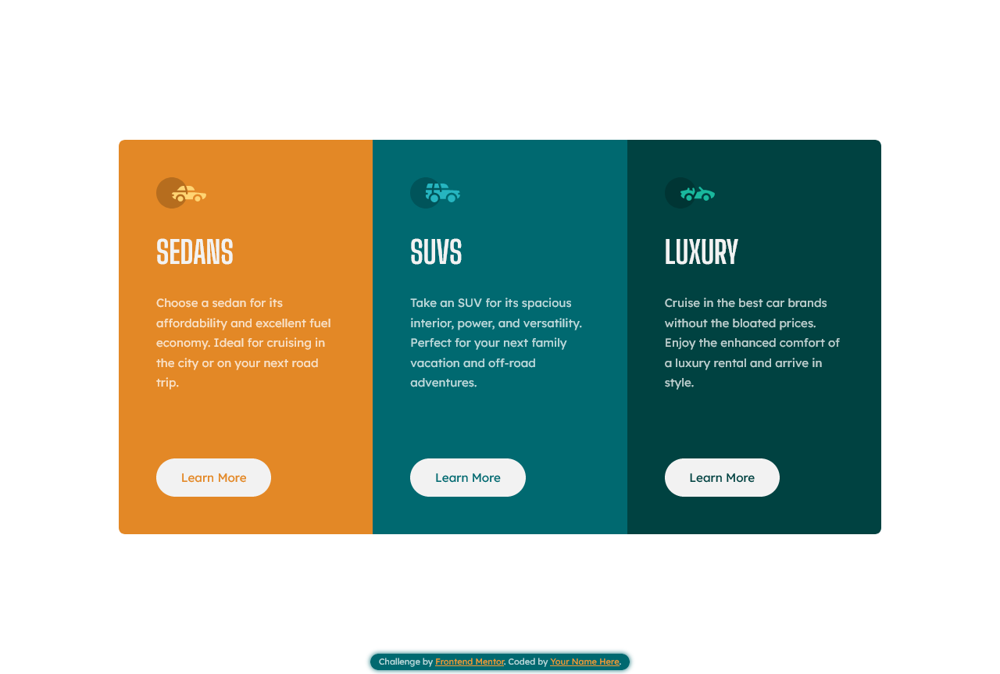
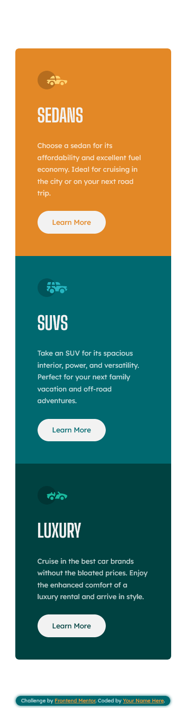

# Frontend Mentor - 3-column preview card component solution

This is a solution to the [3-column preview card component challenge on Frontend Mentor](https://www.frontendmentor.io/challenges/3column-preview-card-component-pH92eAR2-). Frontend Mentor challenges help you improve your coding skills by building realistic projects. 

## Table of contents

- [Overview](#overview)
  - [Screenshot](#screenshot)
  - [Links](#links)
- [My process](#my-process)
  - [Built with](#built-with)
  - [What I learned](#what-i-learned)
- [Author](#author)


## Overview

### Screenshot




### Links

- Solution URL: [Solution URL](https://www.frontendmentor.io/solutions/responsive-column-preview-card-component-using-flex-and-grid-mr33gsOWz6)
- Live Site URL: [Live site URL](https://famous-klepon-0b8fb8.netlify.app/)

## My process

### Built with

- Semantic HTML5 markup
- CSS custom properties
- Flexbox
- CSS Grid
- Mobile-first workflow

### What I learned

Usage of CSS grid

```css
.card-container{
    margin: 5.5em 0;
    display: grid;
    grid-template-columns: 1fr;
    max-width: 21em;
}
```
```css
@media (min-width: 63em) {
    .card-container {
        margin: 0;
        grid-template-columns: repeat(3, 1fr);
        max-width: 61em;
    }
}
```

## Author

- Frontend Mentor - [@Mr-jaw](https://www.frontendmentor.io/profile/Mr-jaw)


